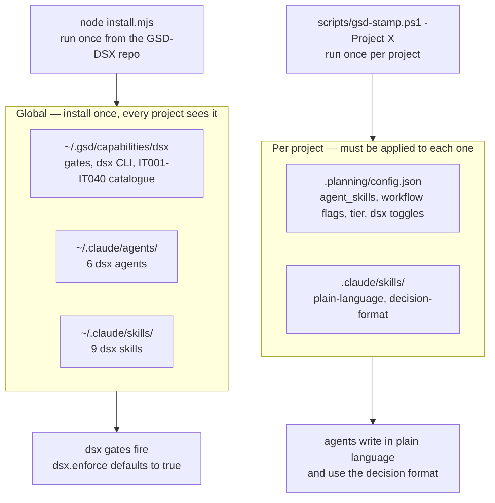
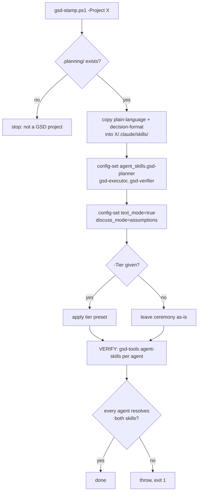
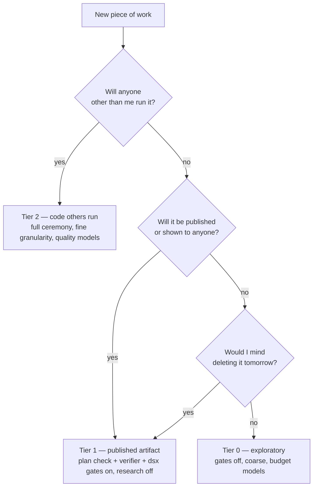
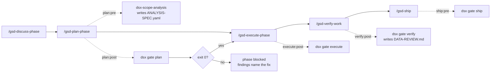
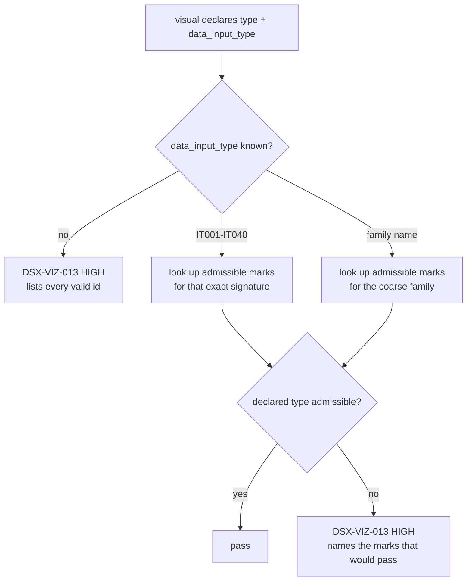
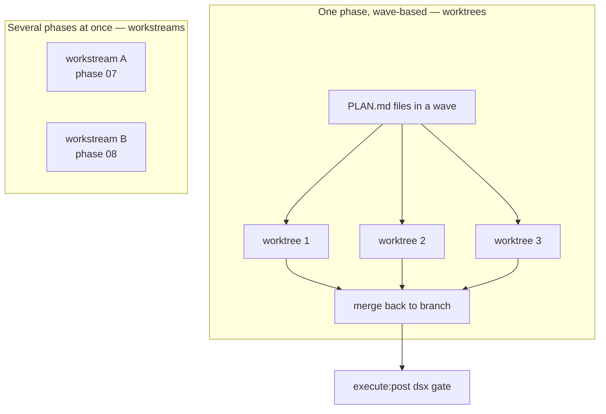
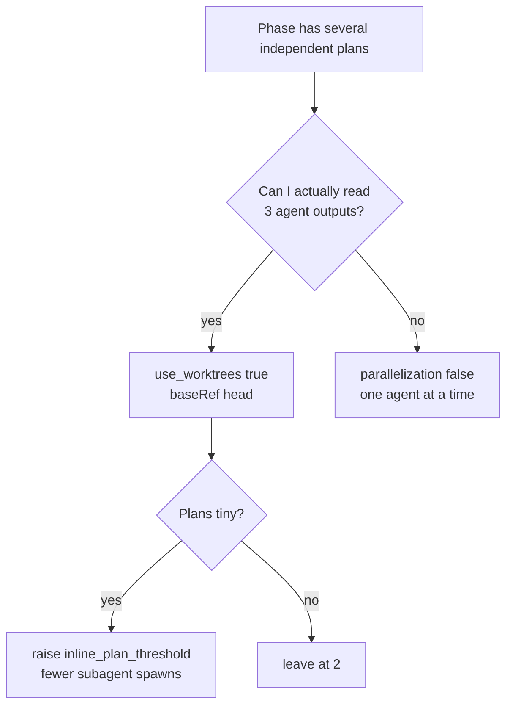
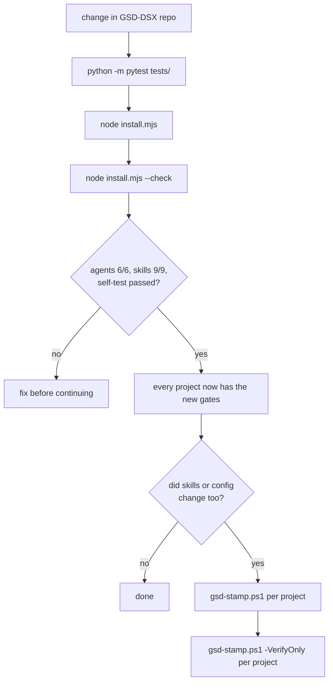
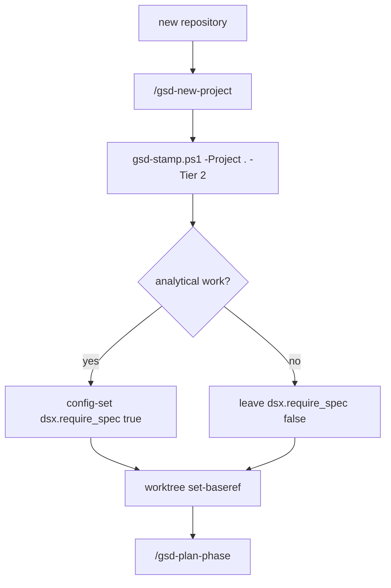

# Operating guide

How GSD-DSX and the house-style skills reach a project, how to choose a ceremony
tier, and how to run several phases at once without losing track of them.

Written against GSD Core 1.7.0 and GSD-DSX 2.0.0. Every claim here was checked
against the running system rather than the reference documentation, because the
two disagree in at least one place — see [gsd-tiers.md](gsd-tiers.md).

---

## 1. What is already global, and what is not

This is the single most useful thing to understand, because it decides how much
work adopting a change actually is.

The dsx capability is installed **once** and is visible from every directory on
the machine, including directories that are not projects yet. The house-style
skills and all configuration are **per project**.



**Verified:** the `dsx` capability resolves from `warehouse_humanoid_tco`,
`metric_lineage_simulator` and an empty scratch directory. `dsx.enforce` has a
declared default of `true`, so gates fire in a project that has never been
configured.

**A trap worth knowing:** `~/.gsd/defaults.json` looks like a global config, and
it is not. It applies only when a directory has **no** `.planning/` folder. An
existing project always reads its own `.planning/config.json`, so editing the
defaults file changes nothing for work already under way.

---

## 2. Rolling out to a project

One command per project. It copies the two skills, wires them to the three
agents that talk to you, sets the readability flags, and then verifies by
resolving the skills back out rather than trusting that the write succeeded.

```powershell
pwsh scripts/gsd-stamp.ps1 -Project C:\Users\Benutzer1\Dev\warehouse_humanoid_tco -Tier 2
pwsh scripts/gsd-stamp.ps1 -Project . -VerifyOnly
```



### Why the verify step is not optional

`config-set` accepts a comma-separated skill list, reports `"updated": true`,
and the config file then looks correct on inspection. The resolver treats the
whole string as one path, finds nothing, and the agent silently receives zero
skills. Only the array form works.

```powershell
# WRONG — writes cleanly, resolves to nothing
config-set agent_skills.gsd-planner "skills/a,skills/b"

# RIGHT
config-set agent_skills.gsd-planner '["skills/a","skills/b"]'
```

The general rule this is an instance of: **verify the effect, not the write.** A
command exiting zero proves it wrote something, not that anything reads it.

---

## 3. Choosing a ceremony tier

Full presets and the exact commands are in [gsd-tiers.md](gsd-tiers.md). The
decision itself is short.



The one asymmetry worth remembering: **Tier 1 keeps the dsx gates on.** A
published chart is exactly where a misleading encoding does damage, because
somebody reads it and believes it. Tier 0 turns them off because a throwaway
notebook has no audience to mislead.

```powershell
pwsh scripts/gsd-tier.ps1 -Tier 0    # exploratory
pwsh scripts/gsd-tier.ps1 -Tier 1    # published artifact
pwsh scripts/gsd-tier.ps1 -Tier 2    # code others run
pwsh scripts/gsd-tier.ps1 -Show      # read current values, change nothing
```

---

## 4. The phase loop and where dsx blocks it

Five gates, all blocking, all shelling out to the bundled Python command-line
tool. They are declarative in `capabilities/dsx/capability.json`, so they fire
without anyone remembering to run them.



A phase with no `ANALYSIS-SPEC.yaml` passes straight through — the gates use
`--allow-missing`. That is what makes it safe to leave enabled in a repository
where only some phases are analytical. Set `dsx.require_spec true` in a project
that is purely analytics.

### The chart gate specifically



Ask the lookup instead of guessing:

```bash
dsx charts IT005 --relationship comparison   # bar, bullet, dot_plot, horizontal_bar
dsx charts --list                            # the whole catalogue
```

---

## 5. Running work in parallel

Two different mechanisms, often confused.

**Worktrees** parallelise *plans inside one phase*. The executor forks an
isolated git worktree per plan in a wave, runs them concurrently, and merges.
This is automatic when `workflow.use_worktrees` is true.

**Workstreams** parallelise *phases against each other*, each with its own state.



### The one setting that silently disables parallelism

Worktrees are forked from `origin/HEAD` by default. If your branch has commits
that `origin/HEAD` does not — which is true of every milestone branch mid-flight
— GSD degrades to sequential execution and prints a one-line warning that is
easy to miss.

This repository already has the fix:

```json
// .claude/settings.local.json
{ "worktree": { "baseRef": "head" } }
```

Apply it to any project where parallel execution matters:

```bash
node ~/.claude/gsd-core/bin/gsd-tools.cjs worktree set-baseref
node ~/.claude/gsd-core/bin/gsd-tools.cjs worktree base-check
```

### Deciding how much to parallelise



There is **no** setting that caps concurrent agents at a specific number.
`parallelization` is a switch, not a dial: `true` runs waves, `false` runs one
at a time. `workflow.inline_plan_threshold` is the nearest thing to a dial — it
controls how small a plan has to be before it runs inline instead of spawning a
subagent, which is really a control on how many separate outputs you have to
read.

---

## 6. Propagating a change in GSD-DSX to every project

When the capability changes — new check, new finding code, new catalogue entry —
this is the whole loop. Note that step 3 is *not* needed for capability changes,
only for skill or config changes.



The asymmetry is the point: **capability changes are global and instant**, while
**skill and config changes are per project and manual**. That is why the stamp
script exists.

---

## 7. Command reference

| Task | Command |
|---|---|
| Install or upgrade the capability globally | `node install.mjs` |
| Check the install | `node install.mjs --check` |
| Stamp skills and wiring into a project | `pwsh scripts/gsd-stamp.ps1 -Project X` |
| Check a project's wiring only | `pwsh scripts/gsd-stamp.ps1 -Project X -VerifyOnly` |
| Switch ceremony tier | `pwsh scripts/gsd-tier.ps1 -Tier 0\|1\|2` |
| Read current tier values | `pwsh scripts/gsd-tier.ps1 -Show` |
| Permitted charts for a data shape | `dsx charts IT005 --relationship comparison` |
| Whole chart catalogue | `dsx charts --list` |
| Every closed vocabulary | `dsx vocab` |
| Run one gate by hand | `dsx gate plan --phase-dir .planning/phases/07-x` |
| Full audit of a spec | `dsx audit --spec ANALYSIS-SPEC.yaml` |
| Read the decision trail | `dsx explain` |
| Set one config key | `node ~/.claude/gsd-core/bin/gsd-tools.cjs config-set <key> <value>` |
| Read one config key | `node ~/.claude/gsd-core/bin/gsd-tools.cjs config-get <key>` |
| Confirm skills reach an agent | `node ~/.claude/gsd-core/bin/gsd-tools.cjs agent-skills gsd-planner` |
| Fix worktree base for parallelism | `node ~/.claude/gsd-core/bin/gsd-tools.cjs worktree set-baseref` |

`gsd-tools` is not on PATH on this machine, which is why the full path appears
above. Adding `~/.claude/gsd-core/bin` to PATH would shorten every one of them.

---

## 8. Onboarding a brand-new project



For an existing repository, `/gsd-onboard` replaces `/gsd-new-project` and adds
codebase mapping and document ingest first.
